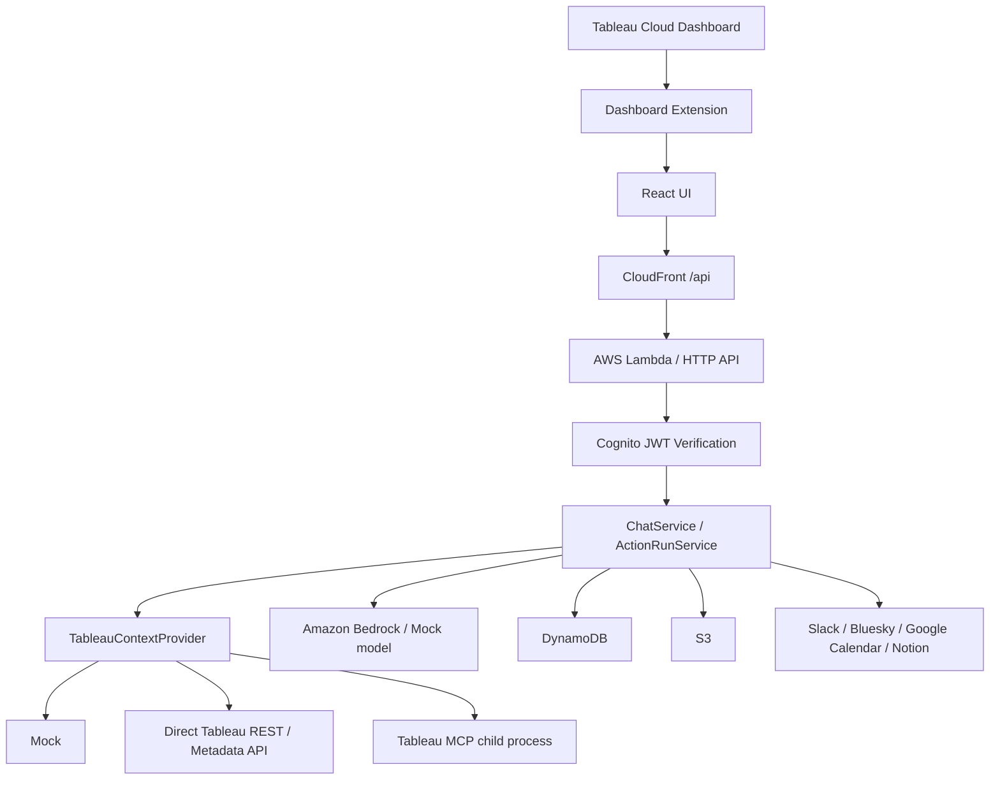

# アーキテクチャ

このリポジトリは、Tableau ダッシュボード拡張として動く PR 支援エージェントです。  
現在の主要 UI は `frontend/src/components/PrPostAgentPanel.tsx` で、チャット、画像アップロード、Calendar 連携、Slack / Bluesky 承認投稿をまとめて扱います。

## 全体像

## 主要な処理フロー

### 1. ダッシュボード文脈の取得

1. Tableau が `.trex` マニフェストを読み込み、拡張としてフロントエンドを開きます
2. `frontend/src/tableau/tableauExtension.ts` が Tableau Extensions API を初期化します
3. `frontend/src/api/contextApi.ts` が `POST /context` を呼び、ワークブック名などの補完情報を取得します
4. バックエンドの `backend/src/handlers/chatHandler.ts` が `ChatService` に渡し、必要なら文脈を補完します

### 2. 投稿文生成

1. UI で投稿種別を選び、会場写真をアップロードします
2. `POST /action-run-input-images` で画像を S3 に保存します
3. `POST /calendar/resolve` で Google Calendar の候補を取得します
4. 必要なら TechPlay URL を補完し、`POST /action-runs` で分析ジョブを作成します
5. `ActionRunService` が画像、イベント、Tableau 文脈をまとめて `ActionRunAnalysisService` に渡します
6. 必要なら投稿用画像を SVG 生成して S3 に保存します
7. 生成された投稿案と補足情報がフロントエンドに返ります

### 3. 承認投稿

1. Slack 承認バーで文面を編集します
2. `POST /action-runs/{actionRunId}/approval` で Slack 投稿を実行します
3. Slack 投稿が完了した後、必要に応じて `POST /action-runs/{actionRunId}/bluesky-post` で Bluesky にも投稿します
4. 画像は S3 上の公開 URL を使って再利用されます

### 4. 認証

- `AUTH_REQUIRED=true` の場合、フロントエンドは Cognito ポップアップ認証を使います
- バックエンドは Cognito JWT を検証し、`email` claim から Tableau subject を導出します
- Tableau subject はバックエンドで決め、フロントエンドの入力値は信用しません

## データの流れ

### フロントエンド

- `frontend/src/App.tsx`: 認証分岐と Tableau 拡張の初期化
- `frontend/src/components/PrPostAgentPanel.tsx`: 現在のメイン UI
- `frontend/src/api/*.ts`: `chat`, `context`, `action-runs`, `calendar`, `notion`, `auth` の API クライアント
- `frontend/src/auth/cognitoAuth.ts`: Cognito Hosted UI / popup 認証

### バックエンド

- `backend/src/handlers/chatHandler.ts`: 主要ルーティング
- `backend/src/services/chatService.ts`: チャット回答生成
- `backend/src/services/actionRunService.ts`: 投稿草案の生成、承認、Slack / Bluesky 投稿
- `backend/src/services/calendarService.ts`: Google Calendar の文脈解決
- `backend/src/services/techplayService.ts`: TechPlay URL の確認とプレビュー
- `backend/src/services/tableauPhotoPostAnalysisService.ts`: 画像 + 文脈を使った投稿分析
- `backend/src/tableau/tableauMcpContextProvider.ts`: Tableau MCP 実行
- `backend/src/tableau/tableauDirectTrustAuth.ts`: Tableau Connected Apps Direct Trust
- `backend/src/notion/*`: Notion OAuth と下書きプレビュー
- `backend/src/aws/*`: S3 / DynamoDB / SSM / Lambda まわりの共通処理

## 外部連携の位置づけ

- Tableau: `TABLEAU_CONTEXT_PROVIDER` で `mock`, `direct-api`, `mcp` を切り替えます
- Google Calendar: `GOOGLE_CALENDAR_PROVIDER` で `mock` と `google` を切り替えます
- Slack: Incoming Webhook で承認投稿します
- Bluesky: App Password で API 投稿します
- Notion: OAuth で接続し、現在は下書きプレビューを返します
- Bedrock: `MODEL_PROVIDER=bedrock` のときに生成に使います
- S3: 投稿用画像の保存と配信に使います

## 権限と安全性

- 認証が有効な場合、API は Cognito JWT を前提にします
- Tableau の秘密情報はフロントエンドに出しません
- Tableau Connected App の値はバックエンドの Lambda 環境変数として扱います
- Notion / Google Calendar のトークンはバックエンドで暗号化して DynamoDB に保存します
- `query-datasource` などの Tableau MCP 操作は allowlist とサニタイズ設定で制御します
- 画像や投稿文のログ出力は、デバッグ設定が有効なときだけ最小限にします

## 実装ファイルの対応表

| 領域 | 主なファイル |
| --- | --- |
| UI 入口 | `frontend/src/App.tsx` |
| 現在のメイン UI | `frontend/src/components/PrPostAgentPanel.tsx` |
| Cognito 認証 | `frontend/src/auth/cognitoAuth.ts`, `backend/src/auth/cognitoAuth.ts`, `backend/src/handlers/cognitoPopupAuthHandler.ts` |
| Tableau 拡張 | `frontend/src/tableau/tableauExtension.ts` |
| チャット API | `backend/src/handlers/chatHandler.ts`, `backend/src/services/chatService.ts` |
| Health check | `backend/src/handlers/healthHandler.ts` |
| 投稿ジョブ | `backend/src/services/actionRunService.ts`, `backend/src/services/actionRunAnalysisService.ts`, `backend/src/handlers/chatJobWorkerHandler.ts` |
| 画像保存 / 生成 | `backend/src/services/actionRunInputImageService.ts`, `backend/src/services/actionRunImageService.ts`, `backend/src/services/actionRunImageUrlService.ts`, `backend/src/aws/s3.ts` |
| 画像アップロード API | `frontend/src/api/actionRunImageApi.ts` |
| Google Calendar | `backend/src/services/googleCalendarService.ts`, `backend/src/services/googleCalendarOAuthService.ts`, `backend/src/handlers/googleCalendarAuthHandler.ts` |
| Slack 投稿 | `backend/src/services/slackWebhookService.ts` |
| Bluesky 投稿 | `backend/src/services/blueskyPostService.ts` |
| Notion | `backend/src/notion/*`, `backend/src/handlers/notionHandler.ts`, `frontend/src/api/notionApi.ts` |
| Tableau MCP | `backend/src/tableau/tableauMcpContextProvider.ts`, `backend/src/services/tableauMcpToolPlanner.ts` |
| Tableau Direct Trust | `backend/src/tableau/tableauDirectTrustAuth.ts`, `backend/src/aws/secrets.ts` |
| デプロイ | `infra/cloudformation.yaml`, `.github/workflows/deploy-aws.yml` |
